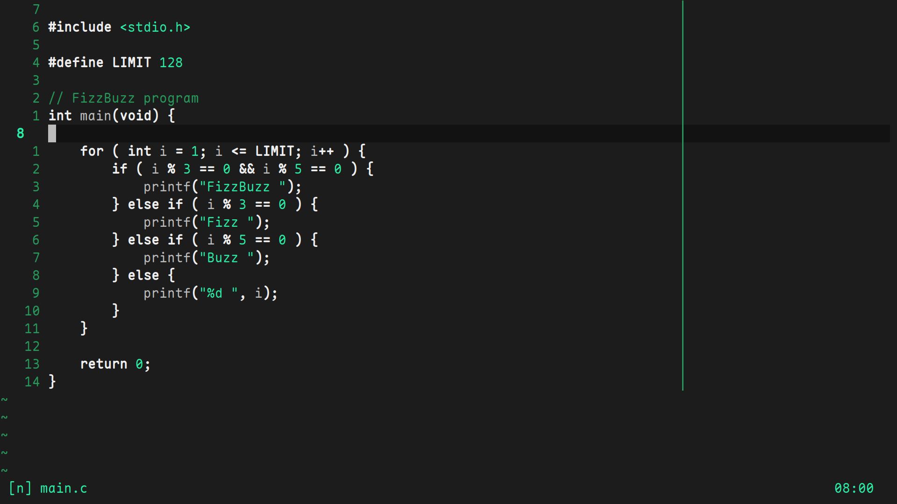
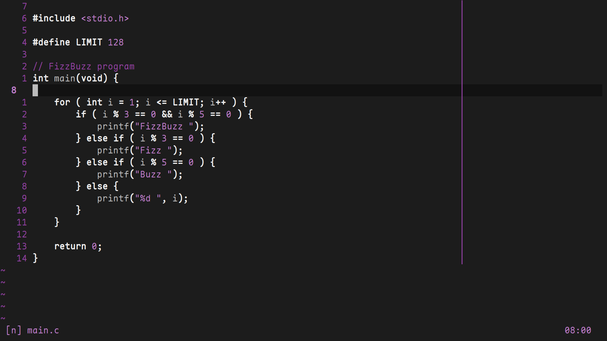
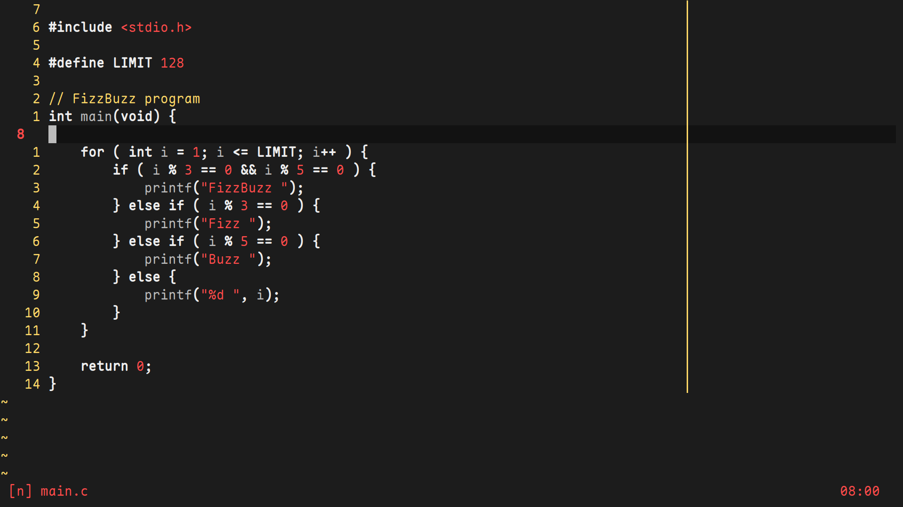
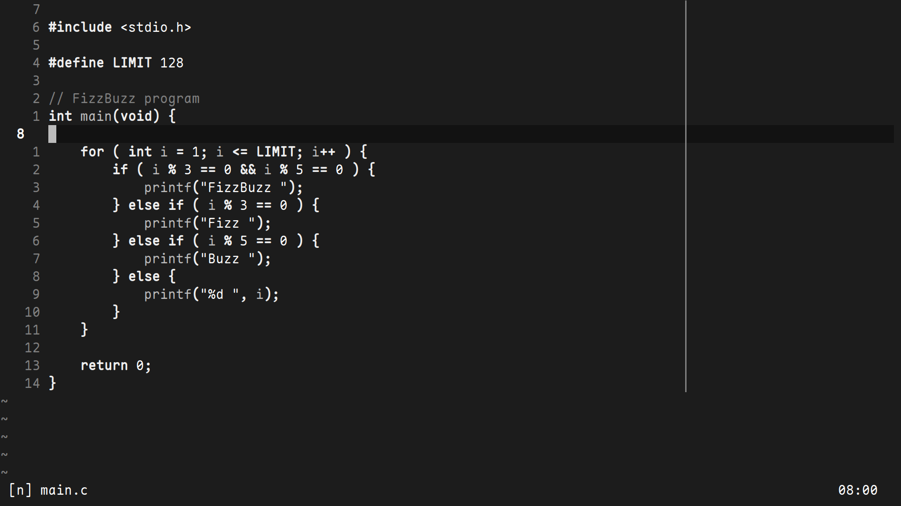

# lazy.nvim

A minimal nvim colorscheme

Based off [film-noir](https://github.com/judah-caruso/film-noir)

## Installation
`lazy.nvim`
```lua
{
    "numen-0/leun.nvim",
    name = "leun",
    dependencies = { "rktjmp/lush.nvim" },
    config = function()
        -- lime (default), green, rose, blue, red, yellow, orange, purple, white
        -- hotdog, doghot, militar
        vim.g.leun_flavour = "lime"

        -- optional
        vim.cmd("autocmd InsertEnter * highlight CursorLine guibg=#181818")
        vim.cmd("autocmd InsertLeave * highlight CursorLine guibg=#121212")
    end,
}
```

## Screenshots
Font: [maple](https://github.com/subframe7536/Maple-font)

Full-setup: [.dotfiles/nvim](https://github.com/numen-0/.dotfiles/tree/main/nvim)

```lua
vim.g.leun_flavour = "lime"
```


```lua
vim.g.leun_flavour = "purple"
```

```lua
vim.g.leun_flavour = "hotdog"
```

```lua
vim.g.leun_flavour = "white"
```


## Usage
```lua
vim.cmd.colorscheme("leun")
```

## Credits
This colorscheme is built with [lush.nvim](http://git.io/lush.nvim)


